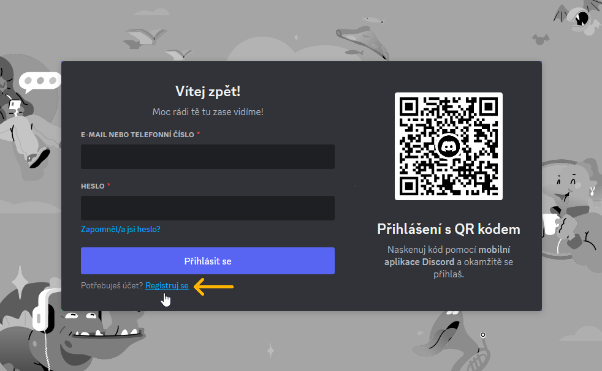
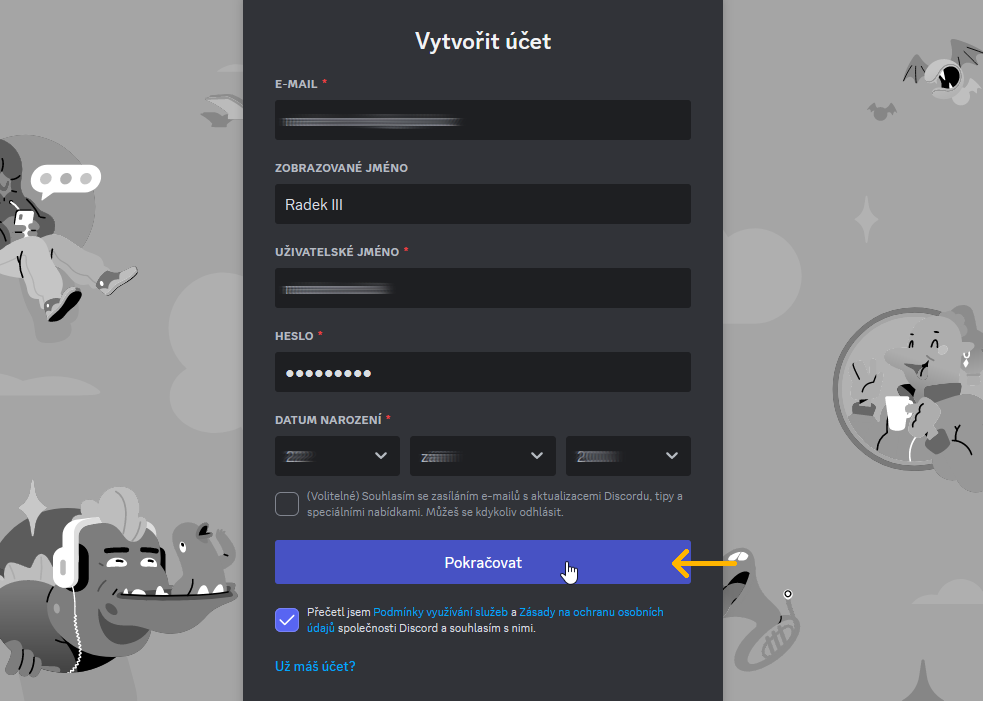
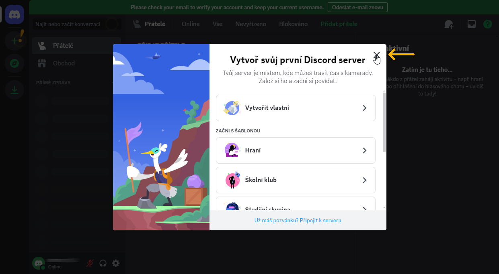
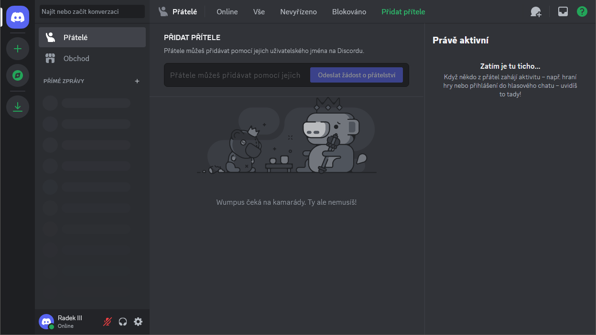

# Založení uživatelského účtu na platformě Discord

Tato sekce popisuje, jak si založit uživatelský účet na platformě Discord. Postup je proveden ve webové aplikaci.

!!! note "Jak se dostat k&nbsp;platformě Discord?"
    Discord je dostupný buď ve webové aplikaci na <a href="https://discord.com/app" target="_blank">https://discord.com/app</a>, nebo jako program pro operační systémy Windows, Linux, MacOS, Android a iOS. Podrobnější informace o&nbsp;podporovaných systémech se nacházejí <a href="https://support.discord.com/hc/en-us/articles/213491697-What-are-the-OS-system-requirements-for-Discord" target="_blank">na webu Discordu v&nbsp;sekci FAQ</a>.

__1.__ Otevřete ve webovém prohlížeči stránku <a href="https://discord.com/app" target="_blank">https://discord.com/app</a> a klikněte na _Registruj se_.

__2.__ Vyplňte požadované údaje. Je nutné mj. zadat platnou e-mailovou adresu, ke které máte přístup. Po vyplnění všech údajů klikněte na tlačítko _Pokračovat_.

__3.__ Abyste mohli váš účet plnohodnotně používat, musíte ověřit svou e-mailovou adresu. Klikněte na tlačítko _Verify Email_ v&nbsp;e-mailu, který přišel na vaši adresu.

__4.__ Váš Discord účet je založen. Zavřete kartu prohlížeče oznamující úspěšné potvrzení e-mailu a vraťte se do karty, kde jste prováděli registraci.

__5.__ Zde zavřete uvítací okno a případně odklikejte nápovědu v&nbsp;podobě žlutých vykřičníků.

__6.__ Nyní jste připraveni na používání platformy Discord.

