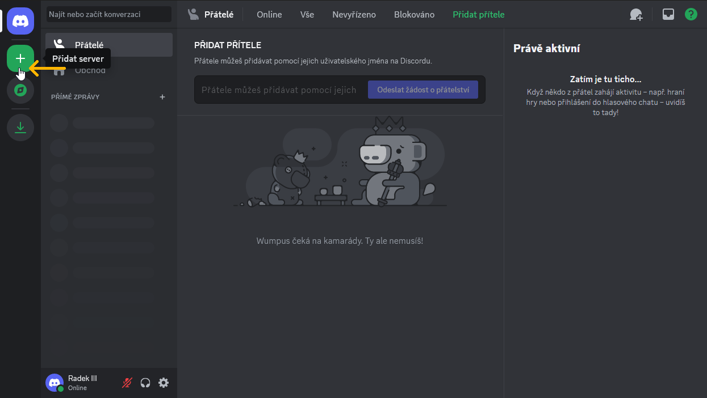
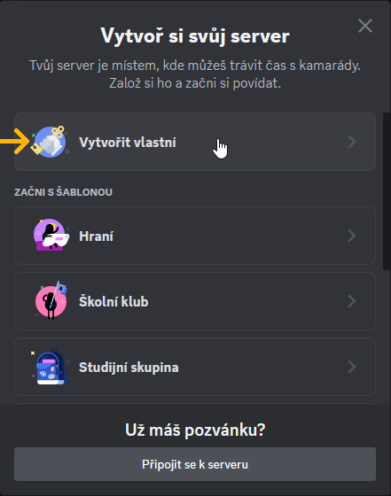
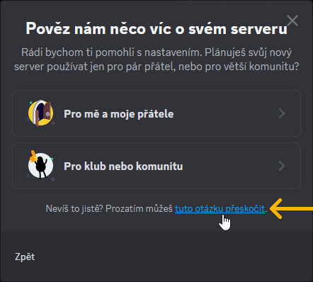
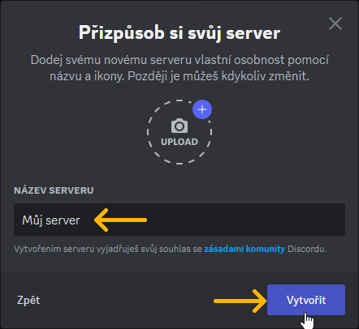
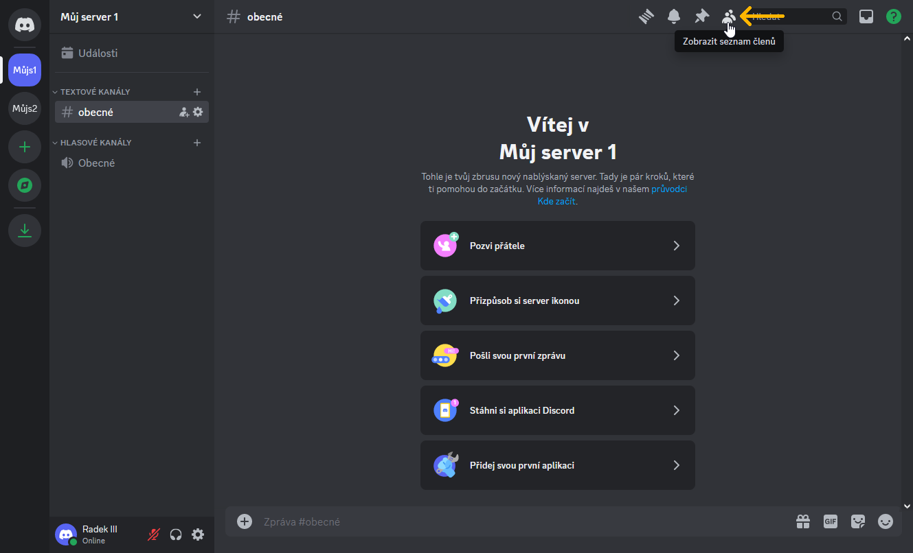
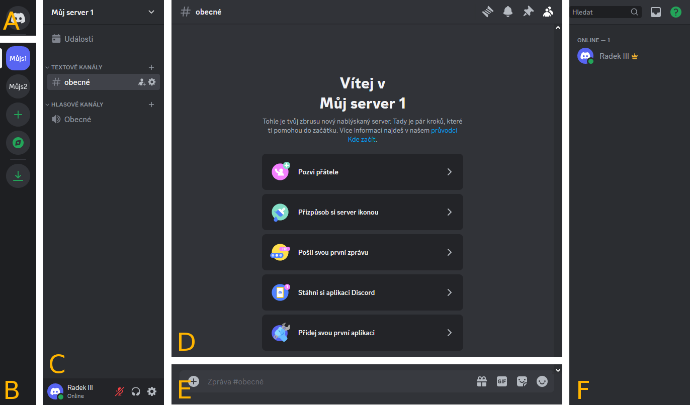

# Vytvoření serveru a jeho uživatelské rozhraní

## Jak vytvořit server

Tato sekce popisuje, jak vytvořit vlastní server.

__1.__ Klikněte na _Přidat server_.

__2.__ Proklikejte se průvodcem vytvoření serveru: 
__2A.__ Klikněte na _Vytvořit vlastní_

__2B.__ Klikněte na _tuto otázku přeskočit_

__2C.__ V&nbsp;kolonce _NÁZEV SERVERU_ můžete změnit název svého serveru. Potvrďte kliknutím na _Vytvořit_.

__3.__ Server byl vytvořen. Klikněte na _Zobrazit seznam členů_.

## Uživatelské rozhraní serveru

Uživatelské rozhraní Discordu při prohlížení serveru lze rozdělit na 6 hlavních částí. Části jsou v&nbsp;obrázku označeny písmeny _A_ až _F_:

<blockquote>
A&emsp;–&emsp;tlačítko pro přepnutí do DMs 
B&emsp;–&emsp;seznam všech serverů 
C&emsp;–&emsp;seznam všech dostupných kanálů na vybraném serveru 
D&emsp;–&emsp;obsah vybraného kanálu 
E&emsp;–&emsp;kolonka pro odesílání zpráv do vybraného kanálu 
F&emsp;–&emsp;seznam všech členů a botů s&nbsp;přístupem do vybraného kanálu
</blockquote>

Kolonka pro psaní zpráv slouží také pro psaní příkazů, na které reagují boti. Zprávy a příkazy je nutné odesílat klávesou Enter.
