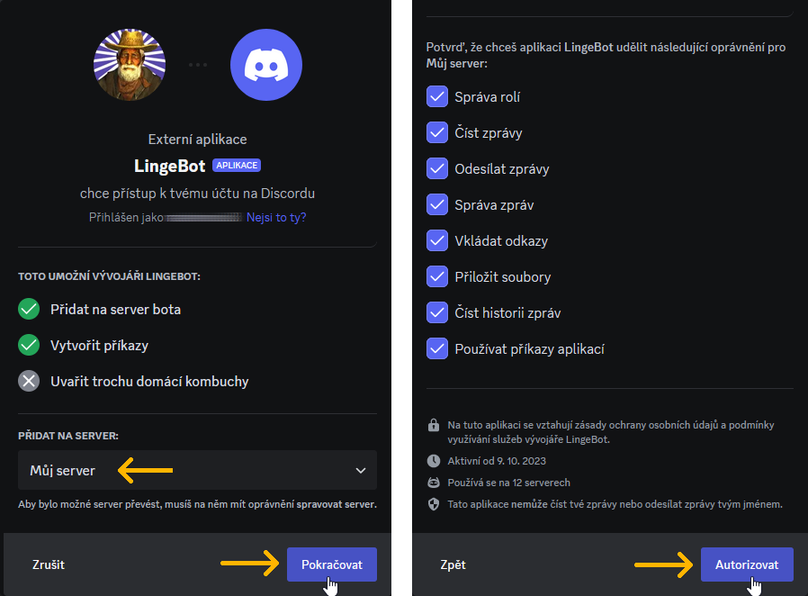
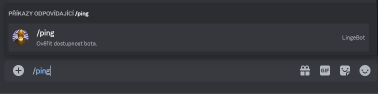
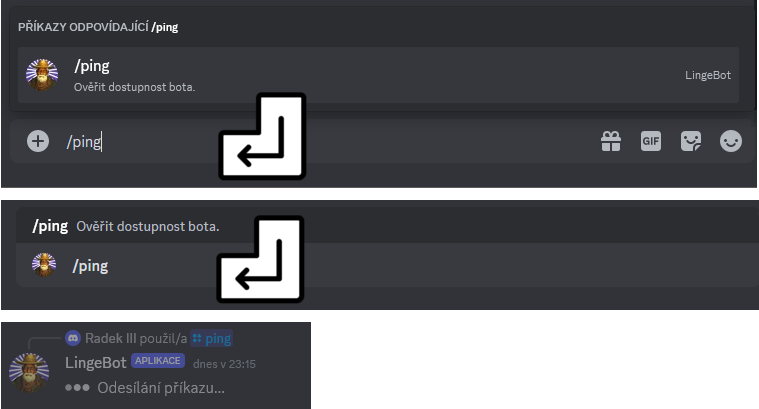
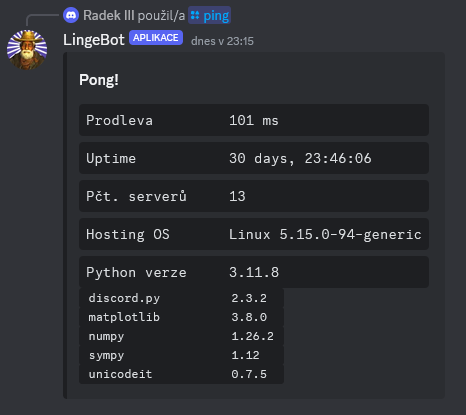

# Přidání bota na server a oveření jeho dostupnosti příkazem `/ping`

## Jak na svůj server přidat hlavní instanci LingeBota

__1.__ V&nbsp;prohlížeči, ve kterém jste přihlášeni do webové aplikace Discord, otevřete tento zvací odkaz:
[https://discord.com/oauth2/authorize ?client_id=1160906076179415070 &permissions=2416045056 &scope=bot+applications.commands](https://discord.com/oauth2/authorize?client_id=1160906076179415070&permissions=2416045056&scope=bot+applications.commands)

__2.__ Ve výběrovém seznamu zvolte server, na který chcete bota přidat. Potvrďte tlačítkem _Pokračovat_ a v&nbsp;následujícím okně tlačítkem _Autorizovat_.

__3.__ LingeBot je nyní členem vybraného serveru. V hlavním textovém kanálu tohoto serveru se objeví oznámení o připojení LingeBota.

---

## Jak odesílat příkazy a ověřit dostupnost LingeBota

__1.__ Napište do kolonky pro zadávání zpráv a příkazů řetězec `/ping`.

Discord během psaní začne našeptávat odpovídající příkazy. Po dopsání celého řetězce už zbyde jen příkaz `/ping`. Pokud se na serveru nachází více botů se stejně pojmenovaným příkazem, zobrazí se zde všechny. Nejvíce relevantní příkaz v&nbsp;seznamu našeptávače je zvýrazněn a tedy vybrán. Pro vybrání jiného lze využít šipek na klávesnici. Výběr je potvrzen stiskem klávesy enter. Alternativně lze příkaz vybrat kliknutím myši.

__2.__ Stiskněte klávesu enter pro potvrzení výběru příkazu `/ping`, druhým stiskem klávesy enter příkaz odešlete.

__3.__ Pokud je bot funkční, odpoví zprávou se základními informacemi o&nbsp;provozu.

