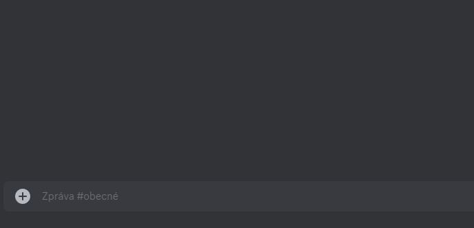
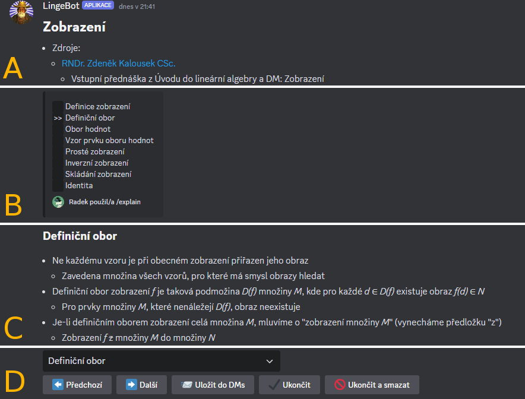

# Výklad teorie

## Princip příkazu `/explain`

Po odeslání příkazu `/explain` se v&nbsp;textovém kanálu objeví rozhraní pro výklad teorie. Výklad funguje tak, že bot do textového kanálu odesílá zprávy, které obsahují výpisky z&nbsp;uživatelem zvoleného matematického tématu. Tyto výpisky jsou vytvořeny provozovatelem bota.

Teoretické materiály se dělí na témata, která se pak dělí na podtémata. Po odeslání příkazu `/explain` se nejprve objeví výběrový seznam, kde si uživatel zvolí jedno téma, které ho zajímá. V&nbsp;textovém kanálu se pak vždy nachází pouze zprávy, které patří k&nbsp;jednomu podtématu vybraného tématu. Mezi podtématy lze přepínat pomocí tlačítek nebo výběrového seznamu.

!!! caution "Upozornění: Mechanismus odesílání/mazání zpráv a jeho rychlost"
    Při přepínání mezi podtématy jsou nejprve do kanálu odeslány zprávy nového podtématu a následně jsou smazány zprávy starého podtématu. Při tomto procesu, který může chvilku trvat, nebudou ovládací prvky reagovat. Pokud je zpráv více, může se proces na chvíli zastavit. Jedná se o&nbsp;omezení ze strany Discordu.

!!! tip "Tip: Výklad teorie v&nbsp;přímých zprávách"
    Používání výkladu teorie v&nbsp;textovém kanálu, kde komunikují nebo používají bota i jiní uživatelé, může být nepřehledné až chaotické. Zprávy odeslané botem se mohou zamíchat s&nbsp;cizími zprávami a teoretické výpisky pak nebudou dobře čitelné.

    Proto je výklad teorie vhodné používat v&nbsp;kanálech s&nbsp;omezeným přístupem nebo v&nbsp;DMs. Pro zahájení konverzace v&nbsp;DMs slouží příkaz `/dm`.

---

## Rozhraní příkazu `/explain`

Výběr tématu z&nbsp;výběrového seznamu: 

Zobrazení vybraného tématu lze rozdělit na 4 části _A_ až _D_: 

<blockquote>A – název tématu a informace relevantní pro celé téma B – přehled dostupných podtémat a právě vybraného podtématu C – obsah aktuálně vybraného podtématu D – výběrový seznam podtémat a ovládací tlačítka </blockquote>

Tlačítko|Funkce
---|---
__⬅️ Předchozí__|Zobrazí předchozí podtéma.
__➡️ Další__|Zobrazí následující podtéma.
__⤴️ Změnit téma__ *|Vrátí se na prvotní výběr tématu.
__📨 Uložit do DMs__|Přepošle aktuální podtéma do DMs.
__✔️ Ukončit__|Ukončí rozhraní – tlačítka zmizí, ale zprávy v&nbsp;kanálu zůstanou.
__🚫 Ukončit a smazat__|Ukončí rozhraní a smaže všechny příslušné zprávy.

*&nbsp;V toto tlačítko se promění tlačítko __➡️ Další__, pokud je aktuální podtéma to poslední.

!!! caution "Upozornění: Mizející tlačítka"
    Pokud od posledního stisknutí tlačítka nebo použití výběrového seznamu uběhne 15 minut, rozhraní se automaticky ukončí a tlačítka i výběrový seznam zmizí.

    Ovládací prvky jsou takto skryty, protože po 15 minutách přestanou fungovat. Důvodem je vypršení platnosti WebHooks tokenu daného rozhraní.

