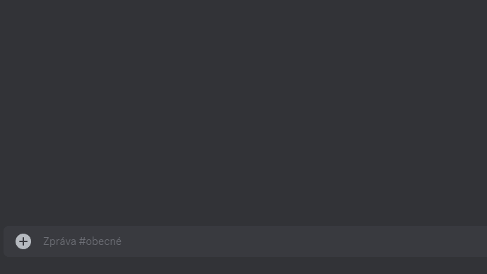
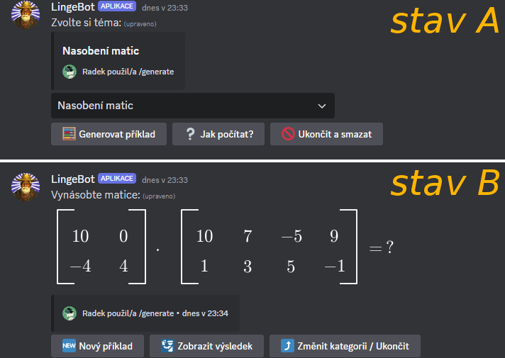

# Generování příkladů

## Princip příkazu `/generate`

Po odeslání příkazu `/generate` se v&nbsp;textovém kanálu objeví rozhraní pro generování příkladů. Nejprve se objeví výběrový seznam dostupných kategorií příkladů. Uživatel si vybere kategorii, která ho zajímá. Po zvolení kategorie si uživatel pomocí tlačítek může buď nechat vygenerovat první příklad, nebo zobrazit návod pro výpočet příkladů z&nbsp;dané kategorie.

Po vygenerování příkladu je zpráva upravena a obsahuje textové zadání příkladu s&nbsp;případným obrázkem. Uživatel může pomocí tlačítek zobrazit výsledek nebo vygenerovat nový příklad.

Návod pro vypočítání příkladu funguje na stejném principu jako výklad teorie. Zprávy s&nbsp;návodem jsou postupně odeslány do textového kanálu.

Pokud pro danou kategorii příkladů není návod dostupný, pak bude tlačítko pro jeho zobrazení vypnuté. Opačný případ, kdy je dostupný pouze návod, ale ne generace, je také možný.

---

## Rozhraní příkazu `/generate`

Výběr kategorie příkladů z&nbsp;výběrového seznamu: 

Po výběru kategorie se rozhraní přepne do _stavu A_: 

Tlačítko (_stav A_)|Funkce
---|---
__🧮 Generovat příklad__|Přepne do _stavu B_, vygeneruje a zobrazí nový příklad.
__❔ Jak počítat__|Odešle do textového kanálu zprávy s tutoriálem pro výpočet příkladu z&nbsp;vybrané kategorie.
__📨 Uložit do DMs__ *|Přepošle tutoriál pro výpočet do DMs.
__🚫 Ukončit a smazat__|Ukončí rozhraní a smaže všechny příslušné zprávy.

*&nbsp;Tlačítko se objeví pouze po použití __❔ Jak počítat__ pod nově odeslanými zprávami.

Tlačítko (_stav B_)|Funkce
---|---
__🆕 Nový příklad__|Vygeneruje a zobrazí nový příklad.
__🛂 Zobrazit výsledek__|Zobrazí výsledek (postup) k&nbsp;atuálnímu příkladu.
__⤴️ Změnit kategorii / Ukončit__|Přepne do _stavu A_.

