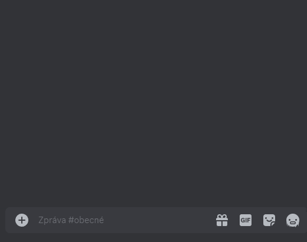

# Vykreslování matematických výrazů

## Princip příkazu `/render` `<text>`

Příkaz `/render` odešle do textového kanálu obrázek s&nbsp;vykresleným matematickým výrazem. Matematický výraz je vykreslen podle parametru `<text>`, který je zadán ve speciálním formátu.

---

## Rozhraní příkazu `/render` `<text>`

Vykreslení výrazu a jeho následná úprava: 

Tlačítko|Funkce
---|---
__✔️ Potvrdit__|Ukončí rozhraní – tlačítka zmizí.
__📝 Upravit__|Vyvolá vyskakovací okno pro úpravu výrazu.
__🗑️ Smazat__|Smaže příslušnou zprávu.

Tlačítka ze zprávy zmizí automaticky po 30 sekundách, aby zbytečně neznepřehledňovala konverzaci.

---

## Pravidla pro zápis matematických výrazů

Pro zápis matematických výrazů se používá Matplotlib Mathtext. Jedná se o&nbsp;podmnožinu jazyka TeX. Seznam všech podporovaných symbolů se nachází v&nbsp;<a href="https://matplotlib.org/stable/users/explain/text/mathtext.html#symbols" target="_blank">dokumentaci balíku Matplotlib</a>. Matplotlib Mathtext nepodporuje TeX prostředí typu `\begin{}\end{}`, do LingeBota byla ale přidána možnost vykreslovat matice a víceřádkové rovnice.

### Zápis matic

Zápis matic je inspirovaný jazykem MATLAB. Do hranatých závorek se postupně vepisují jednotlivé prvky matice po řádcích. Pro oddělení jednotlivých řádků se píše středník a pro oddelění jednotlivých prvků v&nbsp;řádku se píše čárka. Mezery nemají význam na vykreslení, ale mohou zpřehlednit zápis uživatelem. Pro vykreslení hranatých závorek, které se nepromění na matici, lze použít symbolů `\lbrack` a `\rbrack`.

Vstup|Výstup
---|---
`/render` `[1, 2; 3, 4]`|
__Uvnitř matic lze používat TeX příkazy:__|&nbsp;
`/render` `[\cos{\alpha}, -\sin{\alpha}; \sin{\alpha}, \cos{\alpha}]`|
__Matice mohou být součástí výrazů:__|&nbsp;
`/render` `A = [1, 2; 3, 4] \cdot [5, 6; 7, 8]`|
__Matice nemohou být argumentem TeX příkazu:__|&nbsp;
`/render` `B = \sqrt{[1, 2; 3, 4]}`|Nelze vykreslit

### Zápis víceřádkových rovnic

Zapsaní dvou zpětných lomítek `\\` značí nový řádek. Řádky lze zarovnat pomocí amersandu `&`.

Zapsání ampersandu `&` znamená, že znak, který se nachází bezprostředně za ním, bude ten zarovnávací. Obvykle se zarovnává podle rovnítka, zápis je pak tedy `&=`. Pokud se kdekoliv v&nbsp;zápisu objeví dvě zpětná lomítka `\\`, je zápis vždy brán jako víceřádkový. Ve víceřádkovém zápisu je v&nbsp;každém řádku první výskyt ampersandu `&` brán jako zarovnání a samotný ampersand tedy není vykreslen.

Vstup|Výstup
---|---
`/render` `x&=5\\x+y&=6\\C&=[y,2;3,4]`|

