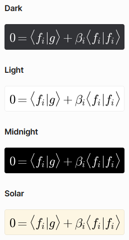

# Nastavení bota

Tato sekce popisuje všechny příkazy začínající na `/setup`.

---

## Nastavení oprávnění<!-- příkazy `/setup permissions`-->

LingeBot umožňuje administrátorům serveru, aby ostatním členům nastavili oprávnění pro používání jednotlivých příkazů a oprávnění pro interakci s&nbsp;jejich rozhraním.

### Změna oprávnění pro použití příkazů

U oprávnění pro použití příkazu jsou na serveru rozlišovány tři množiny členů:

\#|Množina|Do množiny patří...
---|---|---
2|___Admin Only___|... pouze administrátoři.
1|___Admin+LingeMod Only___|... pouze administrátoři a členové s&nbsp;rolí LingeMod.
0|___Anyone___|... všichni členové serveru.

Oprávnění lze nastavit pro tyto akce:

Akce|Popis
---|---
___clear___| příkaz `/clear`
___explain___| příkaz `/explain`
___generate___| příkaz `/generate`
___render___| příkaz `/render` `<text>`

Ve výchozím nastavení je ke všem akcím přiřazena množina _Anyone_ – kdokoliv může používat jakýkoliv příkaz.

Příkaz `/setup permissions set_command` `<action>` `<permission>` umožňuje u&nbsp;vybrané akce změnit její přiřazenou množinu. Do argumentu `<action>` je zadána akce a do argumentu `<permission>` je zadána množina.

Např.: `/setup permissions set_command` `explain` `Admin+LingeMod Only` znamená, že pouze členové s&nbsp;rolí LingeMod a administrátoři mohou používat příkaz `/explain`.

### Změna oprávnění pro interakci s&nbsp;rozhraním

Interakce s&nbsp;rozhraním znamená kliknutí na tlačítko nebo zvolení položky ve výběrovém seznamu u&nbsp;výkladu teorie, generátoru příkladů nebo vykreslení matematického výrazu. Ve výchozím nastavení může s&nbsp;těmito prvky interagovat pouze _autor dané interakce_. Jedná se o&nbsp;uživatele, který použil příkaz, na nějž daná zpráva s&nbsp;interaktivními prvky odpovídá. Oprávnění pro interakce lze ale přidat i administrátorům a členům s&nbsp;rolí LingeMod:

\#|Množina|Do množiny patří...
---|---|---
2|___Author Only___|... pouze autor dané interakce.
1|___Any Admin___|... pouze autor dané interakce a všichni administrátoři.
0|___Any Admin+LingeMod___|... pouze autor dané interakce, všichni administrátoři &nbsp;&nbsp;&nbsp; a všichni členové s&nbsp;rolí LingeMod.

Oprávnění lze nastavit pro tyto akce:

Akce|Popis
---|---
___explain\_btns___| interakce s&nbsp;rozhraním příkazu `/explain`
___generate\_btns___| interakce s&nbsp;rozhraním příkazu `/generate`
___render\_btns___| interakce s&nbsp;rozhraním příkazu `/render` `<text>`

Příkaz `/setup permissions set_buttons` `<action>` `<permission>` umožňuje u&nbsp;vybrané akce změnit její přiřazenou množinu. Do argumentu `<action>` je zadána akce a do argumentu `<permission>` je zadána množina.

Např.: `/setup permissions set_buttons` `render_btns` `Any Admin` znamená, že administrátoři mohou potvrzovat, upravovat a mazat vykreslené matematické výrazy ostatním členům serveru.

### Zjištění aktuálně nastavených oprávnění<!-- příkazem `/setup permissions get`-->

Po odeslání příkazu `/setup permissions get` je administrátorovi zobrazen přehled nastavení oprávnění na daném serveru.

---

## Přidělování role LingeMod<!-- příkazem `/setup lingemod` `<member>`-->

Po odeslání příkazu `/setup lingemod` `<member>` je členovi `<member>` přidána/odebrána role LingeMod.
Pokud člen tuto roli nemá, pak je mu přidána. Pokud ji má, pak je mu odebrána.

Pokud je role LingeMod ze serveru smazána, přestane kontrola oprávnění korektně fungovat. Pro opravu nestačí znovu vytvořit roli se stejným názvem. Roli LingeMod musí vytvořit bot samotný. Pro tyto účely byl přidán prefixový příkaz `$> lingemod_reset`, po jehož odeslání je role znovu vytvořena. Nová role nebude po vytvoření přiřazena k&nbsp;žádným členům.

---

## Změna barevného schématu vykreslovaných matematických výrazů<!-- příkazem `/setup render_theme` `<theme>`-->

Po odeslání příkazu `/setup render_theme` `<theme>` se pro vykreslování matematických výrazů nastaví barevné schéma `<theme>`.

Na serveru toto platí pro všechna vykreslení, která se na něm po odeslání tohoto příkazu odehrají, a nezáleží na tom, kdo použije vykreslovací příkaz. V&nbsp;DMs toto platí pro všechna budoucí vykreslení v&nbsp;DMs včetně těch, které jsou přeposlány ze serveru, kde mohou být vykresleny s&nbsp;jiným schématem.

### Dostupná barevná schémata pro vykreslování matematických výrazů

