# Vytvoření aplikace na Discord Developer Portal

Tato sekce popisuje, jak vytvořit aplikaci na Discord Developer Portal včetně jejího korektního nastavení pro provoz vlastní instance LingeBota, vygenerování zvacího odkazu a vygenerování tokenu.

__1.__ Otevřete ve webovém prohlížeči stránku <a href="https://discord.com/developers/applications" target="_blank">https://discord.com/developers/applications</a> a klikněte na tlačítko _New Application_.

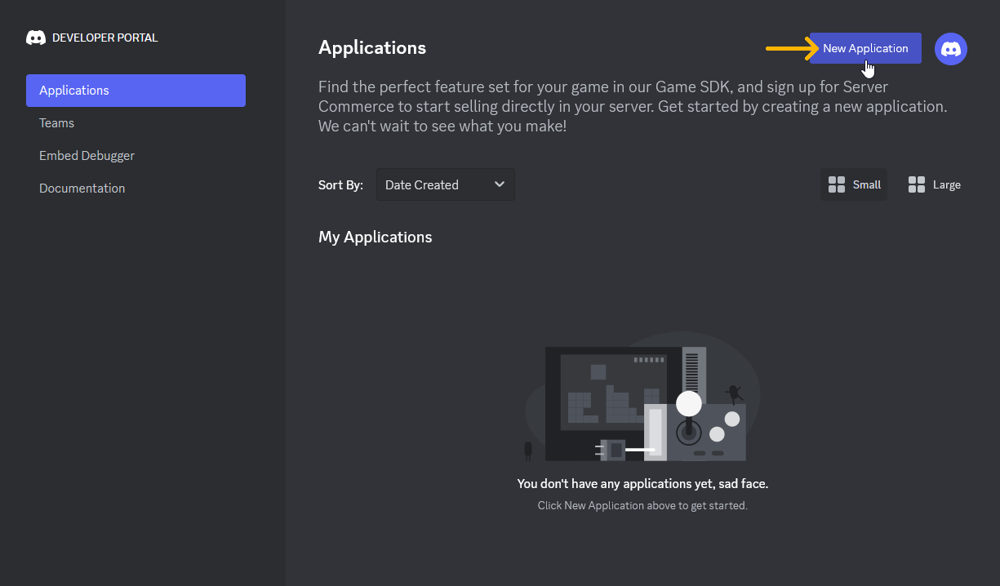

__2.__ Do textového pole napište, jak chcete, aby se váš bot jmenoval. Poté zaškrtněte zaškrtávací pole pro souhlas s&nbsp;podmínkami. Nakonec potvrďte kliknutím na tlačítko _Create_.

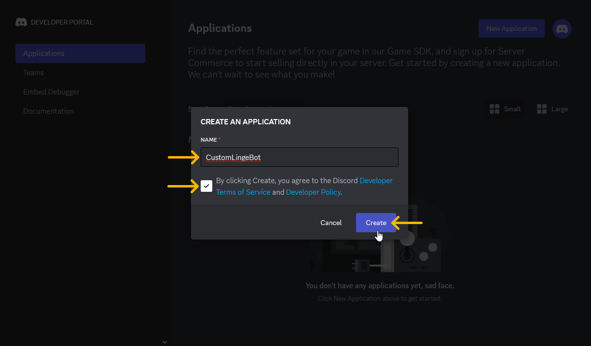

__3.__ Přejděte do sekce _Installation_ kliknutím na příslušné tlačítko v&nbsp;levé navigační liště.

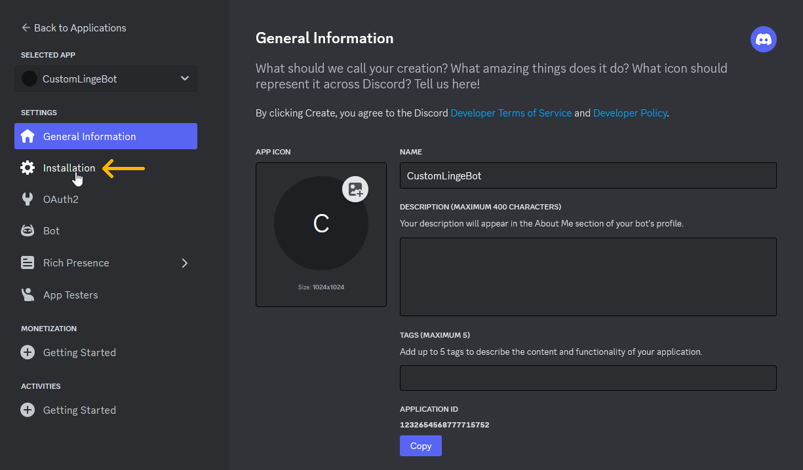

__4.__ V&nbsp;části _Install Link_ zvolte ve výběrovém seznamu možnost _Discord Provided Link_.

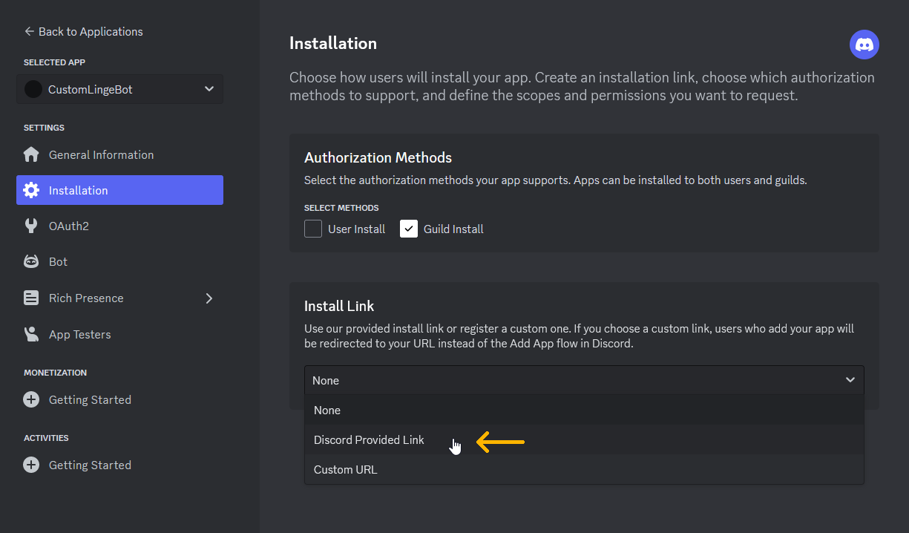

__5.__ Do pole _SCOPES_ v&nbsp;části _Default Install Settings_ přidejte položku `bot`. Můžete buď napsat slovo _bot_ jako u&nbsp;textového pole, nebo položku zvolit jako u&nbsp;výběrového seznamu.

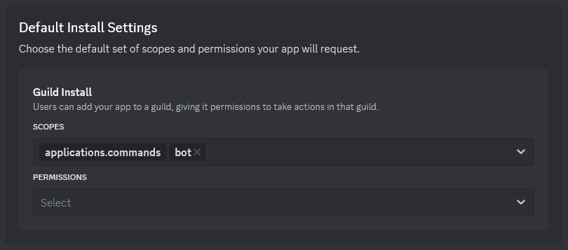

__6.__ Do nově objeveného pole _PERMISSIONS_ přidejte tyto položky:

* `Attach Files`
* `Embed Links`
* `Manage Messages`
* `Manage Roles`
* `Read Message History`
* `Read Messages/View Channels`
* `Send Messages`
* `Use Slash Commands`

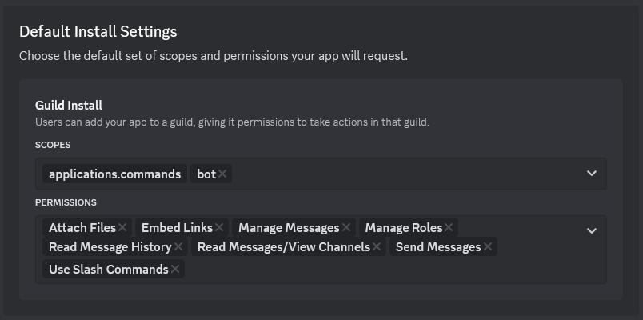

__7.__ Uložte kliknutím na tlačítko _Save Changes_.

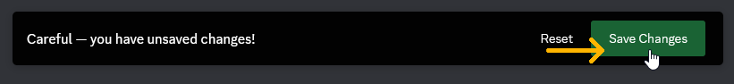

__8.__ Z&nbsp;části _Install Link_ si kliknutím na tlačítko _Copy_ zkopírujte zvací odkaz vašeho bota a někam si ho uložte.

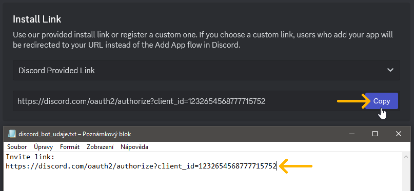

__9.__ Přejděte do sekce _Bot_ kliknutím na příslušné tlačítko v&nbsp;levé navigační liště.

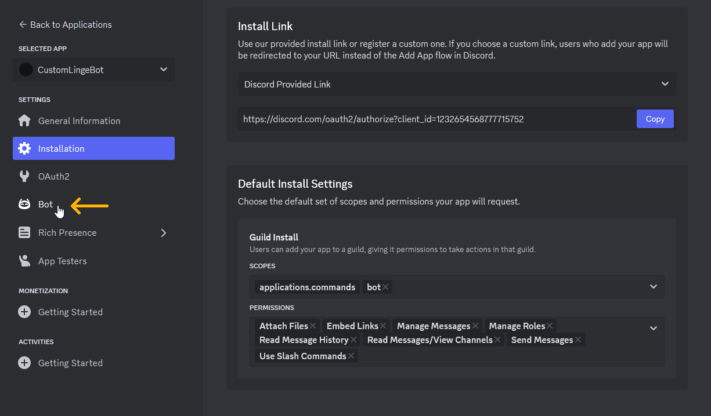

__10.__ Kliknutím na příslušný přepínač povolte možnost _MESSAGE CONTENT INTENT_.

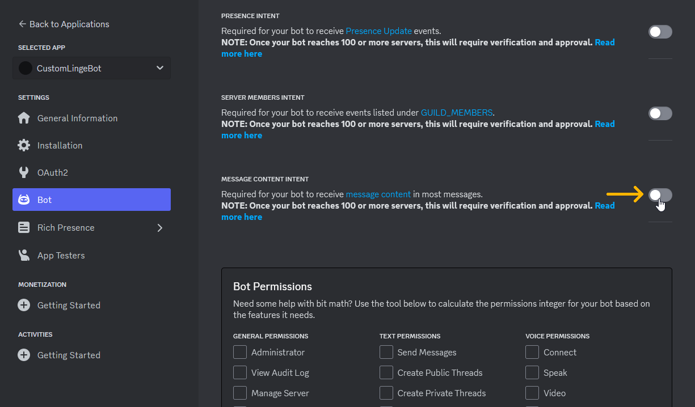

__11.__ Uložte kliknutím na tlačítko _Save Changes_.

__12.__ V části _TOKEN_ klikněte na tlačítko _Reset Token_, potvrďte tlačítkem _Yes, do it!_, poté zadejte své heslo a potvrďte tlačítkem _Submit_.

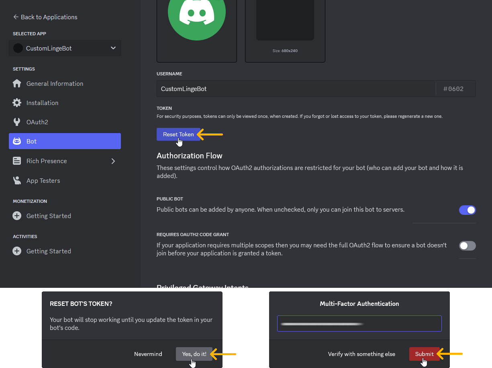

__13.__ V části _TOKEN_ se objevil token vašeho bota. Kliknutím na tlačítko _Copy_ token zkopírujte a někam si ho uložte. Tento token uchovejte v&nbsp;tajnosti.

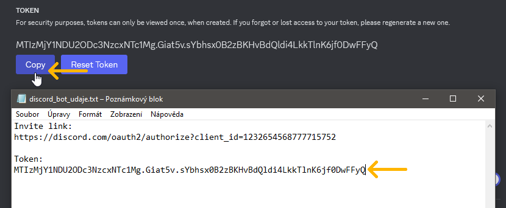

__14.__ Bota nyní můžete přes jeho zvací odkaz pozvat na váš server stejným způsobem, [jako jste pozvali hlavní instanci bota](../01JakZacit/2pozvanibota.md). Bot bude offline, protože zatím neběží jeho obslužný program.

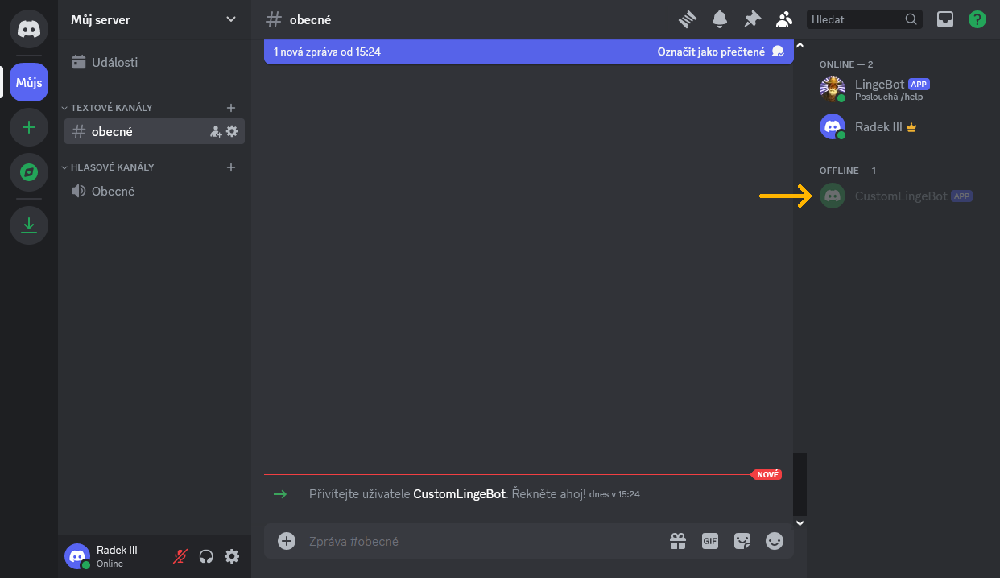
