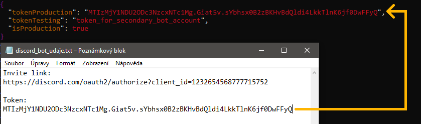
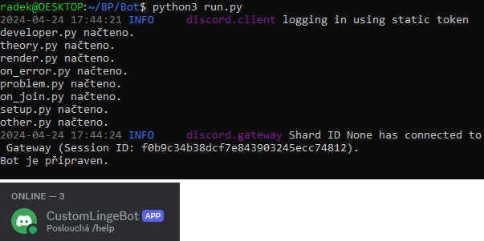

# Stažení zdrojových kódů a první spuštění

Tato sekce popisuje, jak zprovoznit program obsluhující vlastní instanci LingeBota.

Tento postup je proveden v&nbsp;příkazové řádce operačního systému Ubuntu 22. Předpokládá se, že je v&nbsp;systému nainstalován balík Python. Funkčnost programu je ověřena ve verzích 3.10 a 3.11 jazyka Python. Dalším předpokladem je, že [pro bota máte založený účet a vygenerovaný token](./0vytvoreniaplikacenaddp.md).

__1.__ Naklonujte si GitHub repozitář LingeBota.

```shell
git clone https://github.com/RadekMocek/BP
```

__2.__ Přejděte do adresáře `BP/Bot/`, kde se nachází zdrojový kód LingeBota.

```shell
cd BP/Bot/
```

__3.__ Vytvořte konfigurační soubor `config.json` duplikováním souboru `config-example.json`.

```shell
cp config-example.json config.json
```

__4.__ V&nbsp;konfiguračním souboru nastavte hodnotu záznamu `tokenProduction` na token vašeho bota a soubor uložte.

```shell
vim config.json
```



!!! note "Poznámka: tokenProduction vs. tokenTesting"
    Pokud bude váš bot na produkci a zároveň do něj budete chtít přidávat a testovat na něm nové funkce, vyplatí se vytvořit si jeho druhou instanci. Token druhé instance pak nastavíte jako hodnotu záznamu `tokenTesting` a pomocí záznamu `isProduction` můžete snadno přepínat, zdali se spustí bot určený na produkci (`true`), nebo bot určený pro testování (`false`).

__5.__ Nainstalujte potřebné Python balíčky.

```shell
pip3 install -r requirements.txt
```

__6.__ Spusťte skript `db_init.py` pro vytvoření databáze.

```shell
python3 db_init.py
```

__7.__ Spusťte bota spuštěním skriptu `run.py`. Pro budoucí spuštění stačí opakovat tento sedmý krok.

```shell
python3 run.py
```

__8.__ Váš bot je nyní online.


