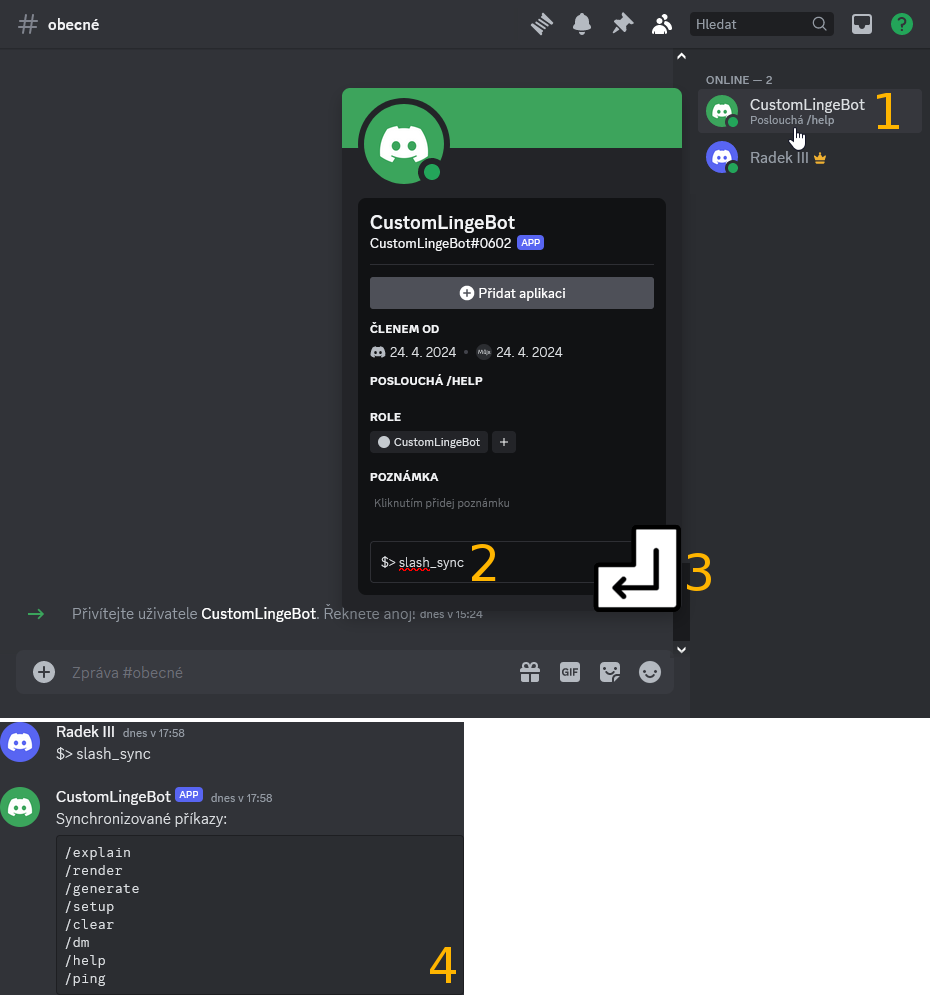
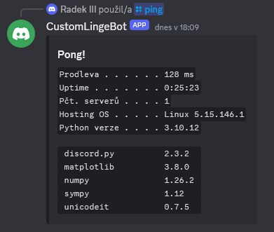

# Synchronizace příkazů

Pokud se pokusíte odeslat nějaký z&nbsp;příkazů vašeho LingeBota, zjistíte, že žádný z&nbsp;nich není součástí našeptávání a z&nbsp;toho důvodu nelze žádný příkaz použít. Podpůrné příkazy totiž musí být synchronizovány s&nbsp;platformou Discord. K&nbsp;tomu slouží prefixový příkaz `$> slash_sync`, který je nutné botovi odeslat v&nbsp;DMs.

__1.__ Klikněte na profil bota v&nbsp;seznamu členů serveru.

__2.__ Do textového pole _Poslat zprávu @jméno_vašeho_bota_ napiště prefixový příkaz `$> slash_sync`.

__3.__ Potvrďte stisknutím klávesy enter.

__4.__ Budete přesměrování do DMs, kde bot potvrdí požadavek na synchronizaci.

!!! caution "Upozornění: Doba trvání synchronizace"
    Synchronizace trvá několik minut. V&nbsp;DMs obvykle příkazy začnou fungovat mnohem rychleji.

__5.__ Po chvilce by měly v&nbsp;DMs začít fungovat příkazy, to můžete otestovat např. příkazem `/ping`.

