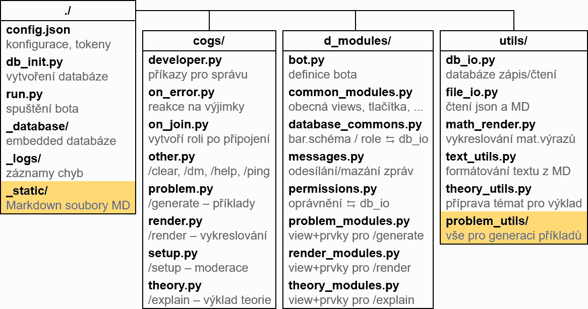
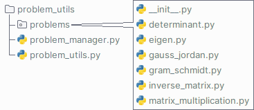

# Struktura projektu

Tato sekce stručně popisuje strukturu souborů projektu LingeBot.

Při [spuštění bota](../03ProvozVlastniInstance/1prvnispusteni.md) jste se již seznámili se soubory `config.json`, `db_init.py` a `run.py`. Další Python moduly, které zajišťují funkčnost bota, se nachází v&nbsp;adresářích `cogs/`, `d_modules/` a `utils/`. Zbylé adresáře, ve kterých se nachází „nepythonovské“ soubory, se nazývají `_database/`, `_logs/` a `_static/`.

Pro rozšíření bota o&nbsp;vlastní teoretické materiály a kategorie příkladů je důležitý adresář `_static/` a podadresář `utils/problem_utils/`:

---

## <!--Adresář -->_cogs/_

Adresář `cogs/` obsahuje moduly, které zajišťují převážně obsluhu podpůrných příkazů. Na zadané příkazy se sice reaguje zde, obvykle je ale jejich obsluha předána do funkcí modulů v&nbsp;adresářích `d_modules/` nebo rovnou `utils/`, kde se provede hlavní logika obsluhy.

---

## <!--Adresář -->_d\_modules/_

Adresář `d_modules/` obsahuje moduly závislé na platformě Discord. Nachází se zde funkce pro obsluhu uživatelských rozhraní jednotlivých příkazů, práci se zprávami, kontrolu oprávnění, ale i&nbsp;definici samotného bota.

---

## <!--Adresář -->_utils/_

Adresář `utils/` obsahuje moduly nezávislé na platformě Discord. Probíhá zde práce s&nbsp;databází a se soubory, vykreslování matematických výrazů a generace příkladů.

### _utils/problem_utils/_

Podadresář `utils/problem_utils/` obsahuje vše potřebné pro generaci příkladů. Nachází se zde balík `problems` (pod-podadresář), v&nbsp;němž každý modul reprezentuje jednu kategorii příkladů. Vedle tohoto balíku se nachází modul `problem_manager.py`, který pomáhá zajistit, aby se jednotlivé kategorie příkladů dostaly až do rozhraní ke koncovému uživateli, a modul `problem_utils.py`, který obsahuje společnou logiku pro více kategorií.

---

## <!--Adresář -->_\_database/_

Adresář `_database/` obsahuje embedded databázi SQLite, kde jsou uložena nastavená barevná schémata, identifikátory rolí LingeMod a nastavení oprávnění pro jednotlivé servery.

---

## <!--Adresář -->_\_logs/_

Adresář `_logs/` obsahuje logovací soubory. Pokud při běhu bota někde nastane chyba, tak by zde měla být zaznamenána.

---

## <!--Adresář -->_\_static/_

Adresář `_static/` obsahuje Markdown soubory s&nbsp;příponou `.MD` (písmena musí být velká).

V podadresáři `_static/problems/` se nachází Markdown soubory s&nbsp;tutoriály pro výpočet jednotlivých kategorií příkladů.

V podadresáři `_static/theory/` se nachází Markdown soubory obsahující jednotlivá témata pro výklad teorie.
