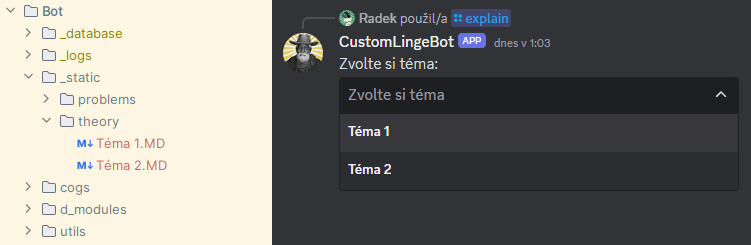
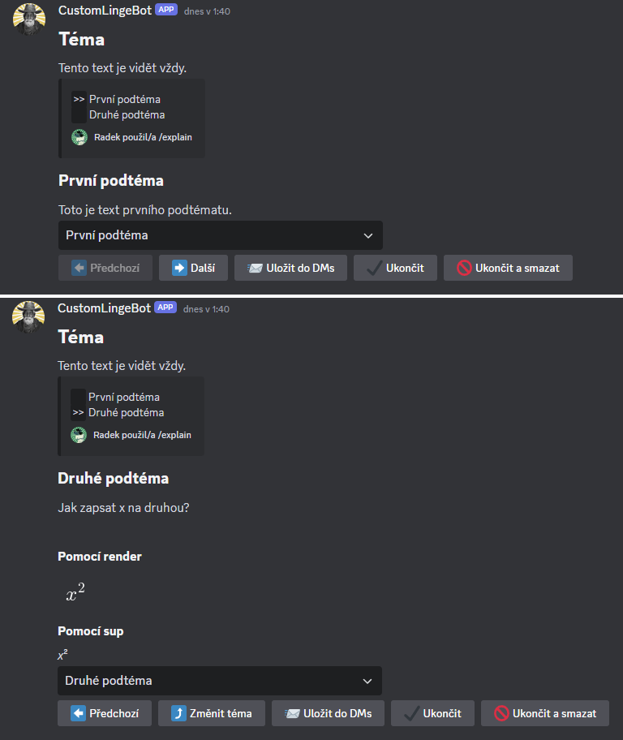

# Vlastní témata pro výklad teorie

Tato sekce popisuje, jak do vlastní instance LingeBota přidat vlastní materiály pro [výklad teorie](../02HlavniInstance/1explain.md).

Výklad teorie probíhá pomocí postupného odesílání zpráv do textového kanálu. Text zpráv je čerpán z Markdown souborů, které se nachází v podadresáři `_static/theory`. Každý soubor v tomto podadresáři, který má koncovku `.MD` (velkými písmeny), představuje jedno teoretické téma. Název položky ve výběrovém seznamu odpovídá názvu příslušného souboru:



Změny provedené v Markdown souborech se projeví při dalším použití příkazu `/explain`, není tedy nutné bota restartovat.

Na prvním řádku každého souboru pro výklad teorie by měl být nadpis první úrovně (hlavní nadpis). Následují nadpisy druhé úrovně, které soubor dělí na jednotlivá podtémata. Všechen text, který následuje za nadpisem druhé úrovně, je součástí příslušného podtématu, dokud se neobjeví další nadpis druhé úrovně. Každý soubor musí mít minimálně jeden nadpis druhé úrovně. Mezi hlavní nadpis a první nadpis druhé úrovně lze vložit text, který je pak společně s hlavním nadpisem přítomen při zobrazení všech podtémat daného tématu.

___Např.:___

```md
# Téma

Tento text je vidět vždy.

## První podtéma

Toto je text prvního podtématu.

## Druhé podtéma

Jak zapsat x na druhou?

### Pomocí render

$$$render
x^2
$$

### Pomocí sup

_x_<sup>2</sup>
```

___se zobrazí jako:___


