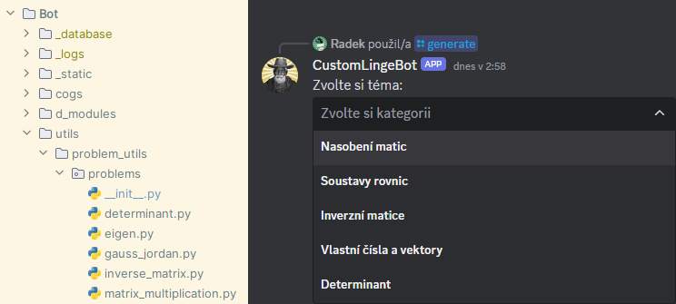
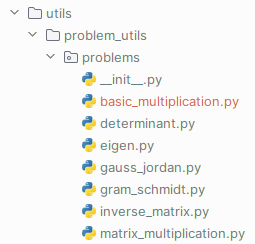
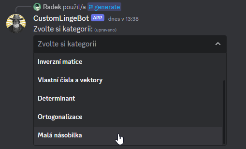
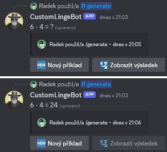
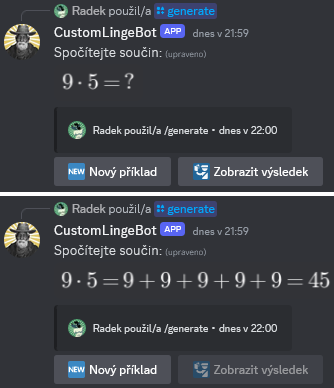
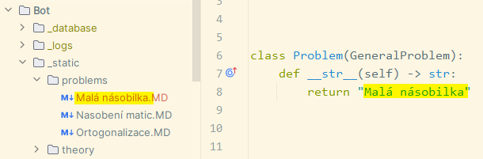
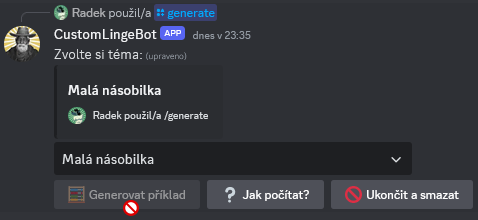

# Vlastní kategorie příkladů

Tato sekce popisuje, jak do vlastní instance LingeBota přidat vlastní kategorie pro [generaci příkladů](../02HlavniInstance/2generate.md). Vyžaduje se znalost programovacího jazyka Python.

Každá kategorie příkladů odpovídá jednomu modulu v&nbsp;balíku `problems` (kromě modulu `__init__.py`), který se nachází v&nbsp;podadresáři `utils/problem_utils/`:



Obsah modulů musí splňovat určitá pravidla a pro přidání kategorie do bota je ještě potřeba několik dalších kroků. Proto bude postup ukázán na jednoduchém příkladu, kdy je přidána kategorie pro malou násobilku:

---

## [1] Vytvoření modulu

__1.1.__ Vytvořte v&nbsp;balíku `problems` nový Python modul `basic_multiplication.py`. Jméno souboru nemá vliv na výsledný název kategorie.



__1.2.__ V&nbsp;modulu naimportujte třídu `GeneralProblem` a definujte třídu `Problem`, která ze třídy `GeneralProblem` dědí.

__1.3.__ Ve třídě `Problem` definujte magickou metodu `__str__`, která vrací řetězec _Malá násobilka_. Obsah řetězce určuje, jak se bude kategorie jmenovat.

__1.4.__ Ve třídě `Problem` definujte metodu `generate_problem` a zatím ji nechte prázdnou.

```py
from utils.problem_utils.problem_utils import GeneralProblem


class Problem(GeneralProblem):
    def __str__(self) -> str:
        return "Malá násobilka"

    def generate_problem(self) -> None:
        pass
```

---

## [2] Zaregistrování modulu

__2.1.__ Do kolekce `__all__` v&nbsp;modulu `__init__.py` z&nbsp;balíku `problems` přidejte položku `"basic_multiplication"`. Jedná se o&nbsp;řetězec obsahující název nově vytvořeného modulu. Na pořadí položek v&nbsp;kolekci nezáleží.

```py
__all__ = [
    "matrix_multiplication",
    "gauss_jordan",
    "inverse_matrix",
    "eigen",
    "determinant",
    "gram_schmidt",
    "basic_multiplication"
]
```

__2.2__ Do kolekce `__problems_list__` v&nbsp;modulu `utils/problem_utils/problem_manager.py` přidejte položku `basic_multiplication.Problem()`. Jedná se o&nbsp;třídu definovanou v&nbsp;kroku 1. Pořadí položek v&nbsp;této kolekci určuje pořadí položek ve výběrovém seznamu po zadání příkazu `/generate`.

```py
problems_list: list[GeneralProblem] = [
    matrix_multiplication.Problem(),
    gauss_jordan.Problem(),
    inverse_matrix.Problem(),
    eigen.Problem(),
    determinant.Problem(),
    gram_schmidt.Problem(),
    basic_multiplication.Problem()
]
```

__2.3.__ Kategorie je nyní vidět ve výběrovém seznamu a lze ji zvolit. Generování příkladů ale nic nedělá, protože tělo metody `generate_problem` je prázdné.



---

## [3] Definice logiky generace příkladů

__3.1.__ Vraťte se do modulu `basic_multiplication.py` z&nbsp;balíku `problems`.

__3.2.__ V&nbsp;metodě `generate_problem` do proměnných `self.task` a `self.answer` uložte text zadání a text řešení vygenerovaného příkladu.

Pokud uživatel klikne na tlačítko __🧮&nbsp;Generovat příklad__ nebo __🆕&nbsp;Nový příklad__, zavolá se metoda `generate_problem` a obsah řetězce `self.task` je zobrazen uživateli. Po kliknutí na tlačítko __🛂&nbsp;Zobrazit výsledek__ se text zprávy změní na obsah řetězce `self.answer`.

Cílem je tedy uvnitř metody nejprve náhodně vygenerovat hodnoty pro příklad a ty pak v&nbsp;čitelné formě dosadit do zmíněných řetězců:

```py
def generate_problem(self) -> None:
    a = random.randint(1, 9)
    b = random.randint(1, 9)
    self.task = f"{a} ⋅ {b} = ?"
    self.answer = f"{a} ⋅ {b} = {a * b}"
```

__3.3.__ Nyní funguje generování příkladů a zobrazení výsledků.



Ve třídě lze definovat další pomocné metody, které se použijí v&nbsp;metodě `generate_problem`. Pokud chcete stejnou logiku používat ve více kategoriích, pak můžete definovat pomocné funkce v&nbsp;modulu `utils/problem_utils/problem_utils.py`.

---

## Vykreslení matematických výrazů v&nbsp;rozhraní generátoru příkladů

Pokud se v&nbsp;řetězci `self.task` nebo `self.answer` za sebou nachází tři symboly dolaru `$$$`, vše za nimi je bráno jako matematický výraz, který je vykreslen. Zpětné lomítko je v&nbsp;jazyce Python únikovým znakem a je tedy potřeba ho v&nbsp;řetězci psát dvakrát – např. `\\cdot` namísto `\cdot`.

```py
def generate_problem(self) -> None:
    a = random.randint(1, 9)
    b = random.randint(1, 9)
    self.task = f"Spočítejte součin:$$${a}\\cdot{b}=?"
    repeated_addition = "+".join(f"{a}" for _ in range(b))
    self.answer = f"{self.task[:-1]}{repeated_addition}={a * b}"
```



---

## Přidání tutoriálu pro výpočet příkladů

Obsah tutoriálu pro výpočet příkladů z&nbsp;určité kategorie je čten z&nbsp;Markdown souboru a odesílán do textového kanálu. Soubor se nachází v&nbsp;adresáři `_static/problems/`, jeho přípona musí být `.MD` (velkými písmeny) a jeho název musí být stejný jako název dané kategorie, který je definován v&nbsp;magické metodě `__str__`.



Tutoriálové Markdown soubory nejsou děleny na témata a podtémata jako u&nbsp;výkladu teorie. Do textového kanálu je po stisknutí tlačítka __❔&nbsp;Jak počítat__ vždy odeslán celý obsah souboru.

---

## Přidání kategorie příkladů pouze s&nbsp;tutoriálem bez možnosti generace

Pokud není k&nbsp;vybrané kategorii příkladů dostupný tutoriál pro výpočet, tlačítko __❔&nbsp;Jak počítat__ je vypnuté. Pokud si přejete pro svou kategorii dodat pouze tutoriál pro výpočet bez možnosti generace příkladů, pak je možný i stav, kdy je vypnuté tlačítko pro generaci. Pro tento stav přidejte do třídy `Problem` metodu `can_generate_problem`, která vrací `False`.

```py
from utils.problem_utils.problem_utils import GeneralProblem


class Problem(GeneralProblem):
    def __str__(self) -> str:
        return "Malá násobilka"

    def can_generate_problem(self) -> bool:
        return False

    def generate_problem(self) -> None:
        pass
```


